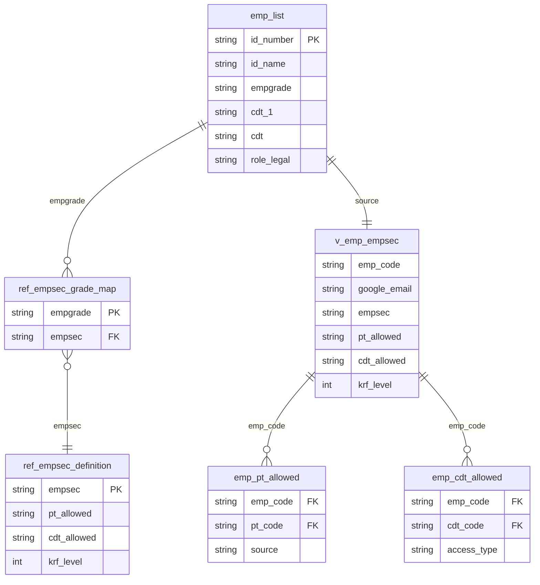

# Hệ thống Phân quyền SEC (PD250 SECURITY)

**Dataset:** `fp-a-project.sec_data`
**Phiên bản:** 1.0
**Ngày tạo:** 2026-03-27

---

## 1. Tổng quan

Hệ thống phân quyền SEC kiểm soát dữ liệu nào mỗi nhân viên được phép xem trong Legal Workflow, dựa trên 3 chiều:

| Chiều | Câu hỏi | Ví dụ |
|-------|---------|-------|
| **PT-ALLOWED** | Được xem Product Type nào? | Chỉ ED & GA / hoặc tất cả |
| **CDT-ALLOWED** | Được xem Cost Dimension Tree nào? | Chỉ team mình / hoặc cả tổ chức |
| **KRF Level** | Được xem sâu đến cấp nào? | PL3 (cấp 3) hoặc PL7 (cấp 7) |

---

## 2. Cấp độ EMPSEC

Mỗi nhân viên thuộc một trong 4 cấp, xác định tự động từ `empgrade`:

### SEC1 — Nhân viên cơ bản
- **Áp dụng cho:** Marketer, Team Lead, QA, Developer, Designer… (`LX0–LX3`, `TX0`, `SX0`, `CM0`)
- **PT:** Chỉ thấy PT được assign trực tiếp (**MyPT**)
- **CDT:** Chỉ thấy CDT của chính mình (**MyCDT**)
- **Độ sâu:** Đến **PL3**
- **Số lượng:** ~349 người

### SEC2 — Trainer / Senior Individual Contributor
- **Áp dụng cho:** Marketer Trainer, Team Lead Trainer (`PM0`, `PM1`, `PX0`, `PX1`)
- **PT:** Thấy **tất cả** PT (**AllPT**)
- **CDT:** Thấy CDT của mình và CDT **mẹ** (**MyCDTParent**)
- **Độ sâu:** Đến **PL3**
- **Số lượng:** ~48 người

### SEC3 — Head of Center / Team Manager
- **Áp dụng cho:** Head of Center, Company Level (`TM0`, `TM1`)
- **PT:** Thấy **tất cả** PT (**AllPT**)
- **CDT:** Chỉ thấy CDT của mình nhưng **sâu hơn** (**MyCDT**)
- **Độ sâu:** Đến **PL7**
- **Số lượng:** ~19 người

### SEC4 — Head of Group / Finance Manager
- **Áp dụng cho:** GM, Senior Manager, Finance (`GM`, `SM0`, `SM1`)
- **PT:** Thấy **tất cả** PT (**AllPT**)
- **CDT:** Thấy **toàn bộ** tổ chức (**AllCDT**)
- **Độ sâu:** Đến **PL7**
- **Số lượng:** ~9 người

---

## 3. Mapping empgrade → EMPSEC

| empgrade | EMPSEC | Mô tả |
|----------|--------|-------|
| `GM` | SEC4 | General Manager |
| `SM0`, `SM1` | SEC4 | Senior Manager |
| `TM0`, `TM1` | SEC3 | Team Manager |
| `PM0`, `PM1` | SEC2 | Product/Project Manager |
| `PX0`, `PX1` | SEC2 | Professional |
| `LX0`–`LX3` | SEC1 | Line Staff |
| `TX0` | SEC1 | Technical |
| `SX0` | SEC1 | Specialist |
| `CM0` | SEC1 | Center Manager |

> **Default:** Bất kỳ empgrade chưa có trong bảng mapping → tự động về **SEC1**

---

## 4. Cấu trúc Database

### Dataset: `fp-a-project.sec_data`

```
sec_data
├── ref_empsec_definition      TABLE   Định nghĩa 4 cấp SEC
├── ref_empsec_grade_map       TABLE   Mapping empgrade → EMPSEC
├── v_emp_empsec               VIEW    Mỗi employee với đầy đủ quyền
├── v_auth_lookup              VIEW    Endpoint cho app (query khi login)
├── emp_pt_allowed             TABLE   Employee × PT được phép xem
└── emp_cdt_allowed            TABLE   Employee × CDT được phép xem
```

#### `ref_empsec_definition`
| Cột | Kiểu | Mô tả |
|-----|------|-------|
| `empsec` | STRING PK | SEC1 / SEC2 / SEC3 / SEC4 |
| `pt_allowed` | STRING | MyPT / AllPT |
| `cdt_allowed` | STRING | MyCDT / MyCDTParent / AllCDT |
| `krf_level` | INT64 | 3 hoặc 7 |
| `description` | STRING | Mô tả nghiệp vụ |

#### `ref_empsec_grade_map`
| Cột | Kiểu | Mô tả |
|-----|------|-------|
| `empgrade` | STRING PK | Mã cấp bậc nhân viên |
| `empsec` | STRING FK | SEC1 / SEC2 / SEC3 / SEC4 |
| `description` | STRING | Mô tả role |

#### `v_emp_empsec` (VIEW — bảng chính thức để dùng)
| Cột | Mô tả |
|-----|-------|
| `emp_code` | Mã nhân viên (từ `fps_data.emp_list`) |
| `emp_name` | Tên nhân viên |
| `google_email` | `LOWER(id_name) + "@apero.vn"` |
| `empgrade` | Cấp bậc |
| `cdt_1` | Mã công ty (HQ1, HQ2, AST…) |
| `cdt` | CDT path đầy đủ |
| `role_legal` | User / Checker / Approver |
| `empsec` | SEC1 / SEC2 / SEC3 / SEC4 |
| `pt_allowed` | MyPT / AllPT |
| `cdt_allowed` | MyCDT / MyCDTParent / AllCDT |
| `krf_level` | 3 / 7 |
| `is_default_sec` | TRUE nếu empgrade không có trong mapping |

#### `emp_pt_allowed`
| Cột | Mô tả |
|-----|-------|
| `emp_code` | FK → emp_list |
| `pt_code` | FK → fps_data.fps_pt |
| `source` | `MyPT` hoặc `AllPT` |

#### `emp_cdt_allowed`
| Cột | Mô tả |
|-----|-------|
| `emp_code` | FK → emp_list |
| `cdt_code` | FK → fps_data.fps_cdt |
| `access_type` | `MyCDT` / `MyCDTParent` / `AllCDT` |

---

## 5. Entity Relationship



---

## 6. Tích hợp Google SSO (Option A — Application Layer)

### Luồng xác thực

```
1. User click "Đăng nhập bằng Google"
       ↓
2. Google trả về email: trangph@apero.vn
       ↓
3. App query v_auth_lookup:

   SELECT *
   FROM fp-a-project.sec_data.v_auth_lookup
   WHERE google_email = 'trangph@apero.vn'
       ↓
4. App nhận session object:
   {
     emp_code:    "F.00011",
     emp_name:    "TrangPH",
     empsec:      "SEC1",
     pt_allowed:  "MyPT",
     cdt_allowed: "MyCDT",
     cdt_1:       "HQ1",
     cdt:         "SHQ1_... | TTE_Tech | TTES_SQA",
     krf_level:   3,
     role_legal:  "User"
   }
       ↓
5. Mọi query tiếp theo inject filter từ session
```

### Quy tắc sinh email

```
google_email = LOWER(id_name) + "@apero.vn"

Ví dụ:
  TrangPH   → trangph@apero.vn
  HoangDNH  → hoangdnh@apero.vn
  TrangLK1  → tranglk1@apero.vn
```

---

## 7. Logic phân quyền theo cấp

|  | SEC1 | SEC2 | SEC3 | SEC4 |
|--|------|------|------|------|
| **PT** | ~3 PT (theo công ty) | 13 PT (tất cả) | 13 PT (tất cả) | 13 PT (tất cả) |
| **CDT** | 1 node (của mình) | 2 nodes (mình + mẹ) | 1 node (của mình) | 12 nodes (tất cả) |
| **Depth** | PL3 | PL3 | PL7 | PL7 |

### PT pool theo công ty (SEC1)

| cdt_1 | Công ty | PT được assign |
|-------|---------|---------------|
| HQ1 | HQ Tech | ED, GA, TO, EN, PE |
| HQ2 | HQ Media | EN, VP, PE, GA, OF |
| SMI | SuperMinds | GA, PE, EN, PT01, PT02 |
| TER | TeraSofts | OF, PT03, PT04, TO, ED |
| VIS | VisionLab | VP, PE, EN, GA, HE |
| AST | Astronex | GA, ED, HE, TO, PE |
| SAP | Asia | EN, GA, PE, OF, TO |
| MGM | Management | OT, OF, TO, PE, ED |

### Ví dụ minh họa — cùng 1 báo cáo

```
Báo cáo chi phí Marketing

TrangPH  (SEC1) │███░░░░░░░░░░░░│  chỉ thấy team QA, ~3 PT
OaiNV    (SEC2) │███████░░░░░░░░│  thấy HQ1 + parent, tất cả PT
GiangPNT (SEC3) │███████████░░░░│  thấy Astronex Marketing sâu, tất cả PT
HoangDNH (SEC4) │███████████████│  thấy toàn bộ tổ chức, tất cả PT
```

---

## 8. Lưu ý triển khai

- **34 nhân viên** có `id_number = #N/A` bị loại khỏi `emp_pt_allowed` và `emp_cdt_allowed`, nhưng vẫn có trong `v_emp_empsec`
- **`emp_list`** là bảng nguồn (sync từ Google Sheets) — không query trực tiếp, dùng `v_emp_empsec` thay thế
- Khi thêm **empgrade mới**: chỉ cần INSERT vào `ref_empsec_grade_map`, view tự cập nhật
- Khi **reload emp_list** từ Google Sheets: EMPSEC tính lại tự động qua view, không cần can thiệp

---

## 9. Các bước tiếp theo

- [ ] **KRF Layer**: implement `emp_krf` để filter theo CDTOwner / CDTMember
- [ ] **BigQuery Row-Level Security** (Option B): tạo Row Access Policy nếu cần bảo vệ tầng data
- [ ] **Làm đầy emp_list**: bổ sung `id_number` cho 34 nhân viên còn `#N/A`
- [ ] **Validate PT-ALLOWED thực tế**: replace dummy data bằng assignment thực từ hệ thống
